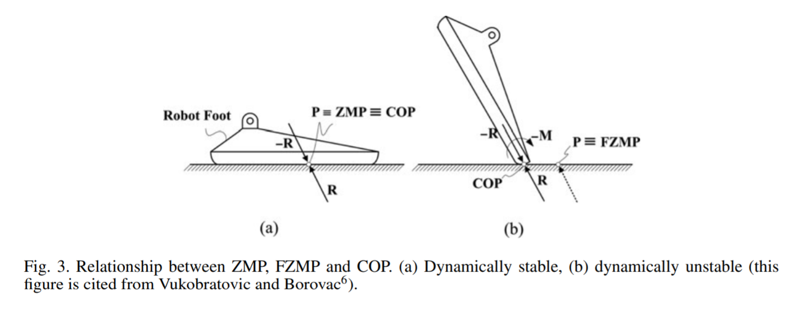
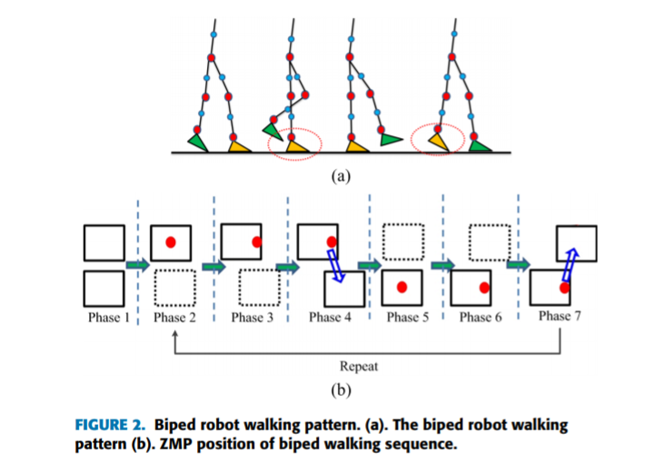
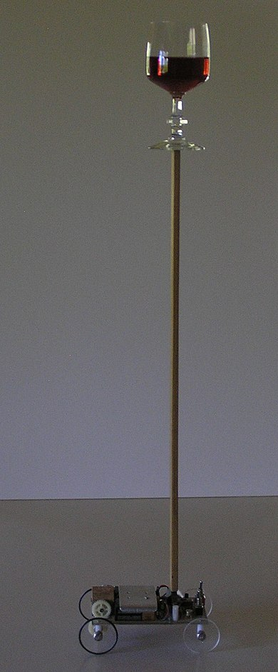
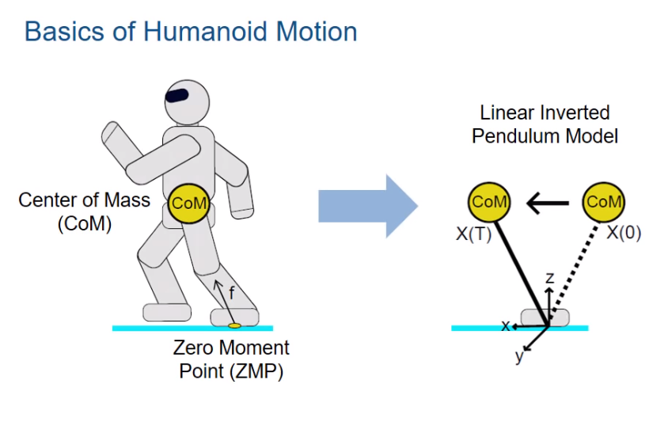
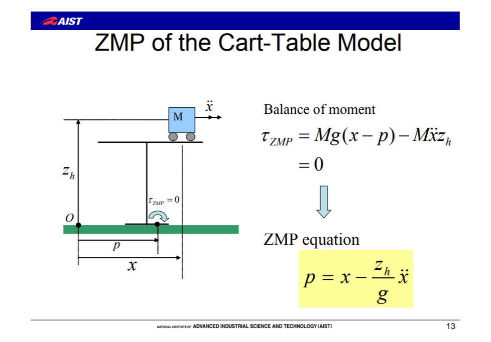
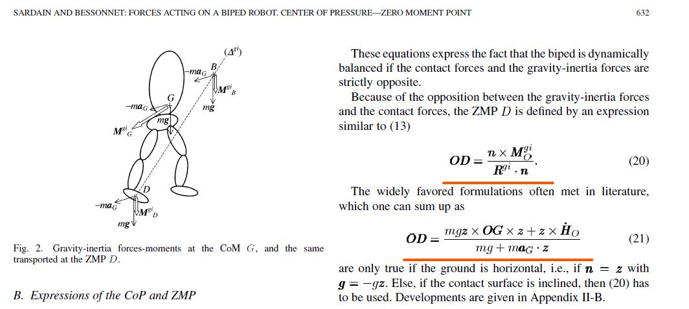

###### Answering to ["Explain Zero Moment Point in bipedal walking robots?"](https://www.quora.com/Explain-Zero-Moment-Point-in-bipedal-walking-robots)

I like how Thomas described it as "dynamic center of mass" which puts the concept into a context vividly! But for someone who has little physics background like me, I will provide more basic details about this concept. Most of the following knowledge came from my recently learning when trying to understand ZMP, so if I am wrong somewhere, please let me know! My thanks and apologies in advance. 

### In short: 
Zero Moment Point(ZMP), or more accurately "zero tipping moment point" as Sardain and Bessonnet point out[^1], is a point on robot's foot(sole) where horizontal moment is zero. Another concept often used along with ZMP to measure and estimate a bipedal robot's stability is Center of Pressure(COP), a point where moment exerted by floor's resultant pressure force on the foot equals to zero. When ZMP and COP overlaps, the robot is in a dynamically stable state. In summary, you can calculate ZMP and COP from a robot's sensors, and when you have both, you can use them to tell the robot how to walk steadily(without falling).

[image source[^2]]

### In more detail: 

#### What is moment?
> The Moment of a force is a measure of its tendency to cause a body to rotate about a specific point or axis. This is different from the tendency for a body to move, or translate, in the direction of the force. In order for a moment to develop, the force must act upon the body in such a manner that the body would begin to twist. This occurs every time a force is applied so that it does not pass through the centroid of the body. A moment is due to a force not having an equal and opposite force directly along it's line of action. (Luebkeman[^3])

In the above definition from an MIT Architectonics class the key idea is how moment is about "tendency to cause a body to rotate(or twist) about a point or axis." In the case of ZMP and bipedal robots, we are interested in the "tendency" of robot's foot to rotate(or to tip) by observing the forces acting on the foot. The moments on ZMP are mainly exerted by gravity force and robot's inertia forces(acceleration at the robot's center of mass)[^1]. 

<iframe width="400" height="230" src="https://www.youtube.com/embed/Fw4qXv62H10" frameborder="0" allow="accelerometer; autoplay; encrypted-media; gyroscope; picture-in-picture" allowfullscreen></iframe>

[Video source[^9]]

In this simulation video(skip to 27"), you can see how ZMP(the green ball on the bottom of the blue line) and the resultant force from the ground on the foot(the blue line) changes dynamically as the robot walks. 

Here is a aerial view of how ZMP changes in a stably walking robot: 

[image source[^4]]

#### How to find ZMP? 
Bipedal walking is often simplified to Inverted Pendulum Model(IPM) to calculate ZMP. Contrary to normal pendulum, which has its center of mass below its pivot point and is stable when hanging downwards, an inverted pendulum has its center of mass above its pivot point and is inherently unstable.(Wikipedia[^5]) See the cart-pole example below where the center of mass is on the wine glass and the pivot point is on the cart:
 

[image source[^5]]

A bipedal robot in walking can also be simplified to an IPM with the center of mass in the robot's hip(or torso) and the pivot point on the ZMP on robot's foot: 
 

[image source[^6]]

Thus, to get ZMP's position in 2D space, we can use the equation in the following figure, where a table-cart system is used to model a 2D IPM(see how the center of mass is on the moving cart and the pivot point(ZMP) is on the table's foot): 

[image source[^7]]

ZMP in 3D space can be calculated using the following equations:

[image source[^1]]

You can find the equation derivation process and their notations in the paper I linked to the image source above(it's also linked in the first recommended readings). 
These two sets of equations are equivalent in essence; they are just describing the same things in different spaces. To understand them, you need to know how force can be calculated from mass and acceleration, and how moment can be calculated from force and distance(lever/moment arm). To not deviate too much in this answer, I will not explain them one by one here. Google these concepts if you are confused but interested, then come back to see if these equations make more sense to you. If not, let me know, I will be happy to explain them to you!

#### How to use ZMP? 
In ZMP-based walking control, instead of planning how each joint on the robot's legs should move, ZMP trajectory(the ZMP trajectory would look something like the red dots in the aerial view of ZMP image) is prescribed to do a preview control. You can think of prescribing ZMP trajectory as planning where and how each robot's foot would land in each step. And the rest of body motion is determined from inverse kinematics using ZMP. To achieve stable ZMP-based walking in bipedal robots, we want the real ZMP trajectory resulted from the robot's motion to map the prescribed ZMP trajectory(often called as reference ZMP). In reality, it is almost impossible, error always exists, so we will need a feedback control system to reduce the error between the prescribed ZMP trajectory and real ZMP trajectory. Since real ZMP can only be obtained after the robot made a move, but we want to prescribe a ZMP position before the robot makes this move, we would need a preview control system instead of usual feedback control system.[^8] I don't want to go into details about inverse kinematics, preview controller and bipedal robot's gait generation here because I am also still learning. (Let me know if you have good learning resources to share!)

Hopefully my explanation above was not misleading and clear enough to help you understand ZMP in bipedal robots. Below are some readings that I found useful when trying to understand ZMP and writing this answer:  

### Recommended readings: 
1. [ZMP detailedly explained](https://ieeexplore.ieee.org/document/1325327/citations?tabFilter=papers#citations)
2. [Nice lecture slides](http://www.cs.cmu.edu/~cga/ew/kajita-dw08.pdf)
3. [Robotics Handbook](https://link.springer.com/referencework/10.1007%2F978-3-540-30301-5)

[^1]: P. Sardain and G. Bessonnet, "Forces acting on a biped robot. Center of pressure-zero moment point," in IEEE Transactions on Systems, Man, and Cybernetics - Part A: Systems and Humans, vol. 34, no. 5, pp. 630-637, Sept. 2004.

[^2]: [Al-Shuka et al. - 2014 - Modeling, stability and walking pattern generators.pdf](https://www.cambridge.org/core/services/aop-cambridge-core/content/view/DD6B82C3D7FDE8D0410D58E160FB2948/S0263574713001124a.pdf/modeling_stability_and_walking_pattern_generators_of_biped_robots_a_review.pdf)
[^3]: [What is a Moment?](http://web.mit.edu/4.441/1_lectures/1_lecture5/1_lecture5.html)
[^4]: [Gait Balance and Acceleration of a Biped Robot Based on Q-Learning](https://ieeexplore.ieee.org/stamp/stamp.jsp?arnumber=7471433)
[^5]: [Inverted pendulum - Wikipedia](https://en.wikipedia.org/wiki/Inverted_pendulum)
[^6]: [Walking Robot Pattern Generation](https://www.youtube.com/watch?v=axK-YVEGReo&t=171s)
[^7]: [Overview of ZMP-basedBiped Walking](http://www.cs.cmu.edu/~cga/ew/kajita-dw08.pdf)
[^8]: Kajita S., Espiau B. (2008) Legged Robots. In: Siciliano B., Khatib O. (eds) Springer Handbook of Robotics. Springer, Berlin, Heidelberg
[^9]: [ROBOY: Humanoid Robot Roboy Walking Research](https://www.youtube.com/watch?v=Fw4qXv62H10)